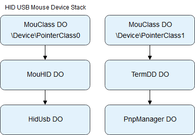
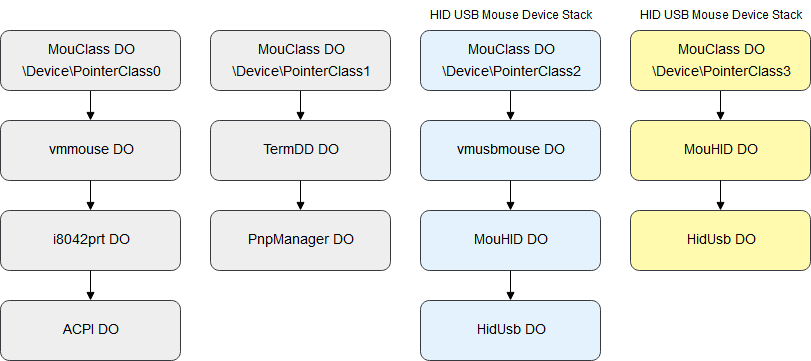

# MouClassInputInjection

MouClassInputInjection implements a kernel interface for injecting [mouse input data packets](https://docs.microsoft.com/en-us/windows/win32/api/ntddmou/ns-ntddmou-mouse_input_data "MOUSE_INPUT_DATA structure") into the input data stream of HID USB mouse devices.

The [MouClass Input Injection](./MouClassInputInjection/mouclass_input_injection.cpp) module injects input by invoking a [mouse class service callback](https://docs.microsoft.com/en-us/previous-versions/ff542394(v%3Dvs.85) "MouseClassServiceCallback routine") to copy synthesized packets to the mouse class data queue in the target HID USB mouse device stack. This module uses the **MouHid Hook Manager** from the [MouHidInputHook](https://github.com/changeofpace/MouHidInputHook) project to dynamically resolve packet data rules for the mouse device stacks on the host machine. The following is a list of enforced rules for injected packets:

1. Button and movement data packets are transferred to the correct data queues.

2. The **UnitId** field matches the device id of the device object which contains the correct data queue.

3. Movement data packets must contain the same type of movement data, **relative** or **absolute**, as packets generated by the physical mouse device.

4. Movement data packets must specify the **MOUSE_VIRTUAL_DESKTOP** indicator flag if packets generated by the physical mouse device specify this flag.

### MouHidInputHook

The **MouHid Monitor** feature of the [MouHidInputHook](https://github.com/changeofpace/MouHidInputHook) project can be used to learn the packet data rules for mouse devices and environments. Users can utilize this feature to debug how mouse actions, e.g., moving the mouse or clicking a mouse button, are represented as a sequence of one or more data packets.

The project README contains an analysis of the input processing system in the Windows kernel. The MouClassInputInjection injection technique is based on this analysis.

## Motivation

This project is designed to be a stealthy, PatchGuard safe means of input injection for video game hack developers. Specifically, this technique enables hack developers to write triggerbots and aimbots which cannot be detected by user mode anti-cheat software. The technique has the following stealth features:

1. The driver does not open process handles for the target process. Anti-cheat software generally audit handle access to the protected video game process.

2. [Mouse events](https://docs.microsoft.com/en-us/windows/desktop/api/winuser/ns-winuser-tagmsllhookstruct "MSLLHOOKSTRUCT structure") for injected packets are __not__ marked with the **LLMHF_INJECTED** or **LLMHF_LOWER_IL_INJECTED** flags.

3. Synthesized packets are validated against the packet data rules for the HID USB mouse device stacks on the host machine. Anti-cheat software can utilize input hooks, e.g., [SetWindowsHookExA](https://docs.microsoft.com/en-us/windows/win32/api/winuser/nf-winuser-setwindowshookexa "SetWindowsHookExA function") and [WM_INPUT](https://docs.microsoft.com/en-us/windows/win32/inputdev/wm-input "WM_INPUT message"), to monitor mouse input data. Malformed data may indicate that a process is injecting input.

Note: This technique has not been tested against kernel mode anti-cheat software.

## Projects

### MouClassInputInjection

The core driver project which implements the injection interface.

### MouiiCL

A command line **MouClassInputInjection** client which allows users to inject mouse button data and mouse movement data via text commands.

## Mouse Device Stacks

A HID USB mouse device has one or more HID USB mouse device stacks in the device tree. These device stacks implement the device interface for reading button data and movement data from the physical mouse device. The number of device stacks required for a mouse device depends on the presence of third party mouse filter drivers. The following image depicts the mouse device stacks for Windows 7 SP1 x64 when no third party filter drivers are active:

    

There is one HID USB mouse device stack for button data and movement data. All data packets from the physical mouse device are transferred to the data queue contained in the **\Device\PointerClass0** device object.

In contrast, the following image depicts the mouse device stacks for Windows 7 SP1 x64 when the VMware vmusbmouse filter driver is active:

    

There are two HID USB mouse device stacks. The **\Device\PointerClass2** device stack receives movement data packets, and the **\Device\PointerClass3** device stack receives button data packets. The VMware Tools package installs the vmusbmouse filter driver to smooth mouse movement. This filter driver hooks into the input data stream by modifying the **CONNECT_DATA** object sent down the mouse movement device stack during device initialization.

## Limitations

* The mouse cursor does not visually update to reflect injected packets for absolute movement when the vmusbmouse filter driver is active.
* The MouClassInputInjection driver will fail to initialize if the MouHid Monitor feature of the MouHidInputHook driver is active.

## Notes

* The MouClassInputInjection project was developed for Windows 7 SP1 x64. Support for other platforms is unknown.
* The MouClassInputInjection injection technique is PatchGuard safe.
